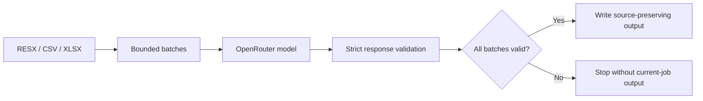

<div align="center">
  

  # ResXTranslator

  **A focused native utility for translating RESX, CSV, and Excel localization files with OpenRouter models.**

  [](https://dotnet.microsoft.com/)
  [](https://learn.microsoft.com/dotnet/maui/)
  [](https://openrouter.ai/)
  [](#platform-status)

  Translate one file or an entire RESX tree, choose any compatible model and BCP-47 locale, monitor parallel requests in real time, and write validated output without replacing the source.
</div>

> [!IMPORTANT]
> ResXTranslator is a source-built personal project with a domain-specific translation prompt for sports fan engagement and ticketing. Review machine-translated output before shipping it. The repository does not currently provide signed installers or an open-source license.

## Contents

- [Why ResXTranslator?](#why-resxtranslator)
- [Feature highlights](#feature-highlights)
- [How it works](#how-it-works)
- [Supported inputs and outputs](#supported-inputs-and-outputs)
- [Spreadsheet format](#spreadsheet-format)
- [OpenRouter translation pipeline](#openrouter-translation-pipeline)
- [Data, credentials, and diagnostics](#data-credentials-and-diagnostics)
- [Platform status](#platform-status)
- [Build and run](#build-and-run)
- [Project structure](#project-structure)
- [Dependencies](#dependencies)
- [Troubleshooting](#troubleshooting)
- [Known limitations](#known-limitations)
- [Contributing](#contributing)
- [Inspiration](#inspiration)

## Why ResXTranslator?

ResXTranslator keeps a common localization job compact: select source content, connect an OpenRouter account, choose a structured-output model and target locale, then translate. It is designed primarily as a native Mac utility instead of a large translation-management suite.

The application can process a single `.resx`, `.csv`, or `.xlsx` file, or recursively discover source RESX files in a folder. It sends bounded batches to OpenRouter, validates every structured response, and delays file writes until all network work for the job has succeeded.

## Feature highlights

### Native workflow

- Focused .NET MAUI interface with light/dark theme support and native controls.
- File picker and recursive folder picker on Apple platforms, plus Finder drag-and-drop on macOS.
- Searchable language catalog generated from the platform's globalization cultures.
- Neutral languages plus regional and script variants, identified by BCP-47 codes such as `fr-CA`, `en-SG`, and `sr-Latn`.
- Output links that reveal generated files in the platform file manager.
- Reduce Motion-aware progress animation on iOS and Mac Catalyst.

### Flexible model selection

- Live OpenRouter model catalog filtered to text models that advertise structured-output support.
- Model search by provider, name, and identifier.
- Input/output pricing shown per million tokens when OpenRouter supplies fixed pricing.
- The selected model is remembered between sessions.
- Optional reasoning is disabled and excluded from responses; required reasoning is excluded and disclosed in usage.

### Reliable translation jobs

- Strict JSON-schema responses with exactly one validated result for every input ID.
- Batches capped at 40 strings and 10,000 source characters.
- Global fair queue that interleaves folder work across files.
- Up to 2 concurrent requests for free or unknown/variable-price models and 4 for paid models.
- Up to 5 provider attempts for a malformed response or provider-specific streaming failure.
- Provider exclusions are scoped to the failed batch, never applied globally.
- 15-minute timeout per batch, whole-job cancellation, and no current-job partial output.
- Live stages for sending, provider connection, streaming, validation, and file writing.
- Whole-operation timing, per-request timing, streamed response size, retry attempts, and token usage.

## How it works

1. Open **Manage…** under **OpenRouter**, paste an [OpenRouter API key](https://openrouter.ai/keys), and connect.
2. Open **Choose…** beside **Model**, search the compatible live catalog, compare pricing, and select a model.
3. Choose or drag in a `.resx`, `.csv`, or `.xlsx` file. Alternatively, choose a folder to scan its complete RESX tree.
4. Choose one target language by English name, native name, country/region, or BCP-47 code.
5. Select **Translate** and monitor the queue. **Cancel Translation** stops the whole job; **Open Diagnostics Log** reveals metadata-only lifecycle records.
6. Reveal the generated file from the success result, or export the currently loaded single file to Excel/CSV.



## Supported inputs and outputs

| Source | What is translated | Translation output | Manual export |
|---|---|---|---|
| Single `.resx` | Plain string `<data>` entries that have a name and `<value>` and no `type` attribute | `<SourceName>.<culture>.resx` | `<SourceName>.xlsx` or `<SourceName>.csv` |
| RESX folder | Every non-empty source `.resx` found recursively; known culture-suffixed outputs are ignored | One `<SourceName>.<culture>.resx` beside each source | Not available for folder selections |
| `.xlsx` | Non-empty `Default` cells, falling back to `en-US` when present | `<SourceName>.translated.xlsx` | `<SourceName>.exported.xlsx` or `.csv` before translation; translated exports keep the `.translated` stem |
| `.csv` | Same logical schema as Excel; quoted commas, quotes, and multiline values are supported | `<SourceName>.translated.csv` | `<SourceName>.exported.csv` or `.xlsx` before translation; translated exports keep the `.translated` stem |

Single-file output is written beside the source when that directory is writable. Otherwise, the app falls back to `Documents/ResXTranslator`, then its application-data directory. Folder jobs write beside each source file and therefore require those folders to be writable.

> [!NOTE]
> RESX input is intentionally string-only. Typed/binary resources are skipped, and localized output is rebuilt as a minimal RESX containing the translated string entries. Original comments, metadata, ordering guarantees, and non-string resources are not copied into the localized file.

## Spreadsheet format

CSV and Excel files are translation-audit documents, not arbitrary two-column spreadsheets.

### Required structure

- A header row containing `Default`.
- At least one adjacent language/status pair, for example `en-US` followed by `en-US Status`.
- Every CSV data row must contain the same number of columns as the header.
- For Excel, the first worksheet matching this structure is used.

Optional conventions understood by the importer:

- If `Default` is blank for a row, `en-US` is used as the source when available.
- If `DefaultFile` exists, language/status pairs are discovered after that column.
- If `Missing` exists, it marks the end of the language-column region.

Example:

| Key | Default | DefaultFile | en-US | en-US Status | Missing |
|---|---|---|---|---|---|
| `WelcomeTitle` | Welcome | `AppResources.resx` | Welcome | Approved |  |
| `BuyTickets` | Buy tickets | `AppResources.resx` | Buy tickets | Approved |  |

Translating to `fr-CA` inserts `fr-CA` and `fr-CA Status` after the last existing language/status pair. Translation values are populated and status cells are left blank for review. A target language that already exists cannot be added again.

## OpenRouter translation pipeline

ResXTranslator uses OpenRouter's `chat/completions` endpoint with streaming enabled and a strict JSON schema. The system prompt asks for natural software localization in a sports fan-engagement and ticketing context while preserving placeholders, interpolation tokens, markup, URLs, whitespace, line breaks, and proper nouns unless a standard localized form exists. Source strings are explicitly treated as untrusted data rather than instructions.

The pipeline is deliberately conservative:

1. Read eligible source strings and split them by count and character budget.
2. Schedule batches through one shared queue; folder batches are ordered round-robin by file.
3. Require providers that support the request parameters.
4. Stream progress and accumulate the structured response in memory.
5. Reject missing, duplicate, unexpected, or malformed translation IDs.
6. Retry provider-specific malformed/failed streams through a different provider, up to five attempts.
7. Write files only after the complete queue validates.

Free models run at most two requests concurrently. Models with a known positive input or output token price run at most four. Missing, negative, or variable pricing uses the conservative two-request limit.

## Data, credentials, and diagnostics

Using the application sends the selected source strings, target locale, model ID, and translation instructions to OpenRouter and the provider it routes to. An internet connection and an OpenRouter account are required; model/provider terms, privacy policies, rate limits, and charges apply.

- **API key:** Stored in the macOS login Keychain for local Mac Catalyst builds. Other platforms use .NET MAUI `SecureStorage`. The key is not stored in application preferences and is not shown again after the account sheet closes.
- **Model preference:** Only the selected model ID is stored in ordinary app preferences.
- **Translation content:** Held in memory while a job runs. The app does not write partial current-job translations before the full queue validates.
- **Diagnostics:** The local log records timestamps, short request/session IDs, model and locale metadata, counts, routing stages, token totals, response sizes, durations, and exception messages. Callers are designed not to log credentials, headers, prompts, or source/translated string content.
- **Log rotation:** `resxtranslator.log` rotates at approximately 1 MB to one `resxtranslator.previous.log` file under the app-data `Logs` directory.

## Platform status

| Platform | Target framework | Configured minimum | Status |
|---|---|---:|---|
| macOS via Mac Catalyst | `net10.0-maccatalyst` | 15.0 | Primary development and documented runtime target |
| iOS | `net10.0-ios` | 15.0 | Project target; compile-validated, not device-verified |
| Android | `net10.0-android` | API 21 | Project target; compile-validated, not device-verified |
| Windows | `net10.0-windows10.0.19041.0` | Windows 10 build 17763 | Declared when building on Windows; not verified by this repository |
| Tizen | Disabled template target | 6.5 | Platform files remain, but the target framework is commented out |

Folder selection uses a native folder picker on iOS and Mac Catalyst. On other enabled targets, choosing a folder falls back to choosing any RESX file within that folder because .NET MAUI has no dependency-free cross-platform folder picker in this project.

## Build and run

### Prerequisites

- [.NET 10 SDK](https://dotnet.microsoft.com/download/dotnet/10.0). The project currently has no `global.json`, so your installed SDK selection rules apply.
- macOS with the Xcode command-line tools and full Xcode installation for Mac Catalyst/iOS builds.
- The platform workload you intend to build.
- An [OpenRouter account and API key](https://openrouter.ai/keys) to run translations.

Install only the Mac Catalyst MAUI workload:

```bash
sudo dotnet workload install maui-maccatalyst
```

Or install the complete MAUI workload set supported by your host:

```bash
sudo dotnet workload install maui
```

Whether `sudo` is needed depends on how and where the .NET SDK was installed. Confirm the result with `dotnet workload list`.

### Clone and restore

```bash
git clone https://github.com/mikoman/ResXTranlsatorMaui.git
cd ResXTranlsatorMaui
dotnet restore ResXTranslator/ResXTranslator.csproj
```

### Build for Mac Catalyst

```bash
dotnet build ResXTranslator/ResXTranslator.csproj \
  -f net10.0-maccatalyst
```

### Build and launch on macOS

```bash
dotnet build ResXTranslator/ResXTranslator.csproj \
  -f net10.0-maccatalyst \
  -t:Run
```

Debug builds default to the current Mac's architecture, such as `maccatalyst-arm64` on Apple silicon. The application bundle is written beneath:

```text
ResXTranslator/bin/Debug/net10.0-maccatalyst/<runtime-identifier>/ResXTranslator.app
```

To compile another enabled platform, replace the target framework with `net10.0-ios` or `net10.0-android`; build the Windows target on Windows. Apple targets set `CreatePackage=false` for local development, so distribution signing and packaging are outside the current project setup.

## Project structure

| Path | Responsibility |
|---|---|
| `ResXTranslator/MainPage.xaml(.cs)` | Main workflow, file/folder input, batching, queue coordination, progress, output, and exports |
| `ResXTranslator/OpenRouterClient.cs` | Authentication checks, live model/provider catalogs, streaming requests, schema validation, retries, and API errors |
| `ResXTranslator/OpenRouterCredentialStore.cs` | Keychain/SecureStorage credential persistence |
| `ResXTranslator/LanguageCatalog.cs` | Searchable platform culture catalog and BCP-47 target metadata |
| `ResXTranslator/ResXParser.cs` | Plain-string RESX reading and localized RESX writing |
| `ResXTranslator/TranslationSpreadsheetDocument.cs` | CSV/XLSX schema validation, language-column insertion, and format-preserving workbook export |
| `ResXTranslator/CsvFile.cs` | UTF-8 CSV parser/writer with quoted and multiline field support |
| `ResXTranslator/ExcelGenerator.cs` | Simple RESX-to-Excel/CSV audit export |
| `ResXTranslator/AppDiagnostics.cs` | Redacted local lifecycle logging and rotation |
| `ResXTranslator/Platforms/` | Platform manifests, startup code, privacy declaration, and native integrations |
| `ResXTranslator/Resources/` | App icon, splash, fonts, images, and semantic light/dark styles |
| `DESIGN.md` | Maintained interface and behavior contract |

## Dependencies

The application intentionally keeps its external dependency surface small:

| Package | Version | Purpose |
|---|---:|---|
| `Microsoft.Maui.Controls` | MAUI workload-managed `$(MauiVersion)` | Cross-platform native UI |
| `Microsoft.Extensions.Logging.Debug` | `10.0.11` | Debug logging integration |
| [`ClosedXML`](https://github.com/ClosedXML/ClosedXML) | `0.105.1` | Reading and writing `.xlsx` workbooks |

OpenRouter integration, RESX parsing, secure storage, HTTP streaming, JSON handling, and CSV support otherwise use .NET and platform APIs.

## Troubleshooting

<details>
<summary><strong>The Mac Catalyst workload is missing</strong></summary>

Run `dotnet workload list`. If `maui-maccatalyst`/`maccatalyst` support is unavailable, install it with `dotnet workload install maui-maccatalyst` using the same SDK installation that runs the build.
</details>

<details>
<summary><strong>The OpenRouter key is rejected</strong></summary>

Open **Manage…**, replace the key, and reconnect. Verify that the key is active in OpenRouter and that the account has any credit required by the selected model.
</details>

<details>
<summary><strong>A selected model disappears</strong></summary>

Open **Choose…**, refresh the live catalog, and select another text model with structured-output support. Saved models can become unavailable when the upstream catalog changes.
</details>

<details>
<summary><strong>A spreadsheet will not open</strong></summary>

Confirm that it has a `Default` header and at least one adjacent `<language>` / `<language> Status` pair. For CSV, also make sure every row has the same column count and that quoted values are closed.
</details>

<details>
<summary><strong>Translation times out or is rate-limited</strong></summary>

Try again after the provider recovers, choose a faster model, or shorten unusually large individual strings. Each batch has a 15-minute timeout; rate-limit and common upstream availability errors are surfaced with recovery guidance.
</details>

<details>
<summary><strong>Output is not beside the selected file</strong></summary>

The source directory was probably not writable. For single-file jobs, check `Documents/ResXTranslator`; if Documents was also unavailable, check the app-data directory. Folder jobs require write access beside every source.
</details>

## Known limitations

- The translation prompt is intentionally specialized for sports, events, venues, rewards, and ticketing terminology; it is not configurable in the UI.
- One target language is added per run.
- Translation requires OpenRouter and therefore is not offline or deterministic.
- Model pricing shown in the app is catalog metadata, not a final cost guarantee.
- RESX output carries plain string entries only; comments, typed resources, and other source metadata are not preserved.
- Spreadsheet input must follow the translation-audit layout described above.
- The repository has no automated test project, packaged release pipeline, or distribution signing setup.
- This repository currently has no license file; review that status before reusing or redistributing the code.

## Contributing

Keep changes aligned with the existing .NET MAUI architecture and the interaction contract in [`DESIGN.md`](DESIGN.md).

Before opening a pull request:

1. Build the narrowest affected target.
2. Exercise file selection, account/model/language selection, translation, cancellation, and output where relevant.
3. Verify both light and dark themes for UI changes.
4. Do not include API keys, credentials, source localization content, logs, signing assets, or generated build output.

## Inspiration

ResXTranslator was inspired by several established localization tools:

- [resxtranslator by HakanL](https://github.com/HakanL/resxtranslator)
- [ResxTranslator by stevencohn](https://github.com/stevencohn/ResxTranslator)
- [Resx-Translator by DamienDoumer](https://github.com/DamienDoumer/Resx-Translator)

Those projects cover broad localization workflows. ResXTranslator exists as a smaller, macOS-first utility built on modern .NET MAUI for this repository's specific translation needs.
