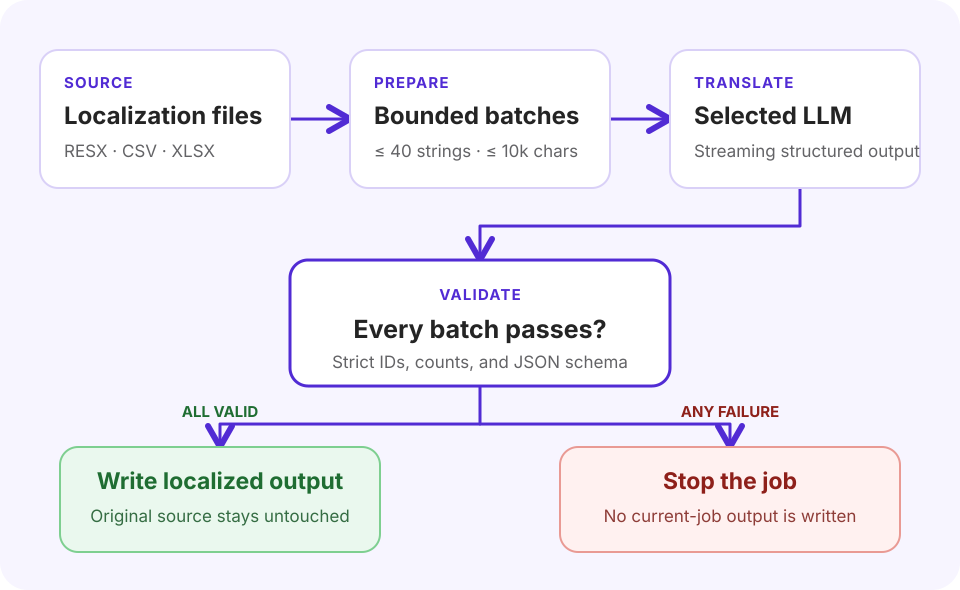

<div align="center">
  

  # ResXTranslator

  **A focused native utility for translating RESX, CSV, and Excel localization files with cloud or local LLMs.**

  [](https://dotnet.microsoft.com/)
  [](https://learn.microsoft.com/dotnet/maui/)
  [](https://learn.microsoft.com/dotnet/ai/microsoft-extensions-ai)
  [](#platform-status)

  Translate one file or an entire RESX tree, choose any compatible model and BCP-47 locale, monitor parallel requests in real time, and write validated output without replacing the source.
</div>

> [!IMPORTANT]
> ResXTranslator is a source-built personal project with a domain-specific translation prompt for sports fan engagement and ticketing. Review machine-translated output before shipping it. The repository does not currently provide signed installers or an open-source license.

## Contents

- [Why ResXTranslator?](#why-resxtranslator)
- [Feature highlights](#feature-highlights)
- [How it works](#how-it-works)
- [Supported inputs and outputs](#supported-inputs-and-outputs)
- [Spreadsheet format](#spreadsheet-format)
- [LLM provider setup](#llm-provider-setup)
- [Translation pipeline](#translation-pipeline)
- [Data, credentials, and diagnostics](#data-credentials-and-diagnostics)
- [Platform status](#platform-status)
- [Build and run](#build-and-run)
- [Project structure](#project-structure)
- [Dependencies](#dependencies)
- [Troubleshooting](#troubleshooting)
- [Known limitations](#known-limitations)
- [Contributing](#contributing)
- [Inspiration](#inspiration)

## Why ResXTranslator?

ResXTranslator keeps a common localization job compact: select source content, connect an LLM provider, choose a strict-structured-output model and target locale, then translate. It is designed primarily as a native Mac utility instead of a large translation-management suite.

The application can process a single `.resx`, `.csv`, or `.xlsx` file, or recursively discover source RESX files in a folder. It sends bounded batches to the selected provider, validates every structured response, and delays file writes until all network work for the job has succeeded.

## Feature highlights

### Native workflow

- Focused .NET MAUI interface with light/dark theme support and native controls.
- File picker and recursive folder picker on Apple platforms, plus Finder drag-and-drop on macOS.
- Searchable language catalog generated from the platform's globalization cultures.
- Neutral languages plus regional and script variants, identified by BCP-47 codes such as `fr-CA`, `en-SG`, and `sr-Latn`.
- Output links that reveal generated files in the platform file manager.
- Reduce Motion-aware progress animation on iOS and Mac Catalyst.

### Flexible model selection

- Presets for OpenRouter, OpenAI, Anthropic, Google Gemini, DeepSeek, Ollama, and LM Studio, plus one custom OpenAI-compatible endpoint.
- Provider model catalogs where available, search by name/identifier, and manual model ID entry.
- A required small strict JSON Schema compatibility test before a model can translate; cloud tests may incur charges.
- Input/output pricing shown per million tokens when OpenRouter supplies fixed pricing.
- Each provider remembers its own endpoint, model, compatibility result, and concurrency setting.
- Persistent domain-and-tone instructions with immutable locale, placeholder, data-safety, and response rules.
- Optional AI assistance that turns a short product description into editable domain instructions using the selected model.
- Optional reasoning is disabled and excluded from responses; required reasoning is excluded and disclosed in usage.

### Reliable translation jobs

- Strict JSON-schema responses with exactly one validated result for every input ID.
- Batches capped at 40 strings and 10,000 source characters.
- Global fair queue that interleaves folder work across files.
- Configurable 1–10 concurrency per provider: cloud presets default to four and local presets default to one. OpenRouter keeps its conservative two-request limit for free or unknown-price models.
- Direct providers retry only connection failures and HTTP 408/429/5xx responses, at most twice after the initial request. Direct translation requests use a batch-sized output-token allowance so a local server finishes generation before the client-side safety guard. A malformed cloud response is never automatically repeated. For a local preset only, one oversized or incomplete completion is discarded and recovered as two smaller sub-batches.
- OpenRouter retains its five-distinct-route recovery behavior. Requests never fail over to another configured provider.
- 15-minute timeout per batch, whole-job cancellation, and no current-job partial output.
- Live stages for sending, provider connection, streaming, validation, and file writing.
- Whole-operation timing, per-request timing, streamed response size, retry attempts, and token usage.

## How it works

1. Choose a provider under **LLM Provider**, open **Manage…**, and connect its API key or local endpoint.
2. Open **Choose…** beside **Model**, select a catalog entry or enter an exact model ID, then allow the disclosed strict-schema test to complete.
3. Optionally open **Translation settings** to customize the product domain and tone, generate a draft from a short description, or change that provider's concurrency.
4. Choose or drag in a `.resx`, `.csv`, or `.xlsx` file. Alternatively, choose a folder to scan its complete RESX tree.
5. Choose one target language by English name, native name, country/region, or BCP-47 code.
6. Select **Translate** and monitor the queue. **Cancel Translation** stops the whole job; **Open Diagnostics Log** reveals metadata-only lifecycle records.
7. Reveal the generated file from the success result, or export the currently loaded single file to Excel/CSV.



In short: source files → bounded batches → selected LLM provider → strict validation. A fully valid job writes localized output without replacing the source; any failed batch stops the job without writing current-job output.

## Supported inputs and outputs

| Source | What is translated | Translation output | Manual export |
|---|---|---|---|
| Single `.resx` | Plain string `<data>` entries that have a name and `<value>` and no `type` attribute | `<SourceName>.<culture>.resx` | `<SourceName>.xlsx` or `<SourceName>.csv` |
| RESX folder | Every non-empty source `.resx` found recursively; known culture-suffixed outputs are ignored | One `<SourceName>.<culture>.resx` beside each source | Not available for folder selections |
| `.xlsx` | Non-empty `Default` cells, falling back to `en-US` when present | `<SourceName>.translated.xlsx` | `<SourceName>.exported.xlsx` or `.csv` before translation; translated exports keep the `.translated` stem |
| `.csv` | Same logical schema as Excel; quoted commas, quotes, and multiline values are supported | `<SourceName>.translated.csv` | `<SourceName>.exported.csv` or `.xlsx` before translation; translated exports keep the `.translated` stem |

Single-file output is written beside the source when that directory is writable. Otherwise, the app falls back to `Documents/ResXTranslator`, then its application-data directory. Folder jobs write beside each source file and therefore require those folders to be writable.

> [!NOTE]
> RESX input is intentionally string-only. Typed/binary resources are skipped, and localized output is rebuilt as a minimal RESX containing the translated string entries. Original comments, metadata, ordering guarantees, and non-string resources are not copied into the localized file.

## Spreadsheet format

CSV and Excel files are translation-audit documents, not arbitrary two-column spreadsheets.

### Required structure

- A header row containing `Default`.
- At least one adjacent language/status pair, for example `en-US` followed by `en-US Status`.
- Every CSV data row must contain the same number of columns as the header.
- For Excel, the first worksheet matching this structure is used.

Optional conventions understood by the importer:

- If `Default` is blank for a row, `en-US` is used as the source when available.
- If `DefaultFile` exists, language/status pairs are discovered after that column.
- If `Missing` exists, it marks the end of the language-column region.

Example:

| Key | Default | DefaultFile | en-US | en-US Status | Missing |
|---|---|---|---|---|---|
| `WelcomeTitle` | Welcome | `AppResources.resx` | Welcome | Approved |  |
| `BuyTickets` | Buy tickets | `AppResources.resx` | Buy tickets | Approved |  |

Translating to `fr-CA` inserts `fr-CA` and `fr-CA Status` after the last existing language/status pair. Translation values are populated and status cells are left blank for review. A target language that already exists cannot be added again.

## LLM provider setup

The first release stores one configuration for each preset and one custom profile:

| Provider | Setup | Notes |
|---|---|---|
| OpenRouter | [Create an API key](https://openrouter.ai/keys) | Keeps catalog pricing and five-route recovery inside OpenRouter. |
| OpenAI | [Create an API key](https://platform.openai.com/api-keys) | Uses OpenAI chat completions with strict JSON Schema. |
| Anthropic | [Anthropic Console](https://console.anthropic.com/settings/keys) | Uses native Messages streaming and structured outputs. |
| Google Gemini | [Google AI Studio API keys](https://aistudio.google.com/app/apikey) | Uses native Gemini model discovery and streaming. |
| DeepSeek | [DeepSeek API keys](https://platform.deepseek.com/api_keys) | Uses the Responses dialect for strict structured output. |
| Ollama | [Install and run Ollama separately](https://docs.ollama.com/) | Mac Catalyst only; defaults to `http://localhost:11434/v1/`. |
| LM Studio | [Start LM Studio's local server](https://lmstudio.ai/docs/developer/core/server) | Mac Catalyst only; defaults to `http://localhost:1234/v1/`. |
| Custom OpenAI-compatible | Provider-specific | HTTPS is accepted anywhere; HTTP is limited to loopback/private-network hosts. The bearer key is optional. |

ResXTranslator does not discover, install, start, stop, or manage a local inference server. Ollama and LM Studio endpoints can be edited for a private LAN host. Other app targets expose the cloud presets and custom HTTPS endpoint, but not the local presets in this release.

Every provider also supports an exact manual model ID. A model remains blocked until a small request proves that the endpoint honors the required strict JSON Schema and preserves several non-sequential IDs exactly. Successful results are cached for the provider, endpoint, model, and schema-contract version; changing any of them invalidates the cache.

## Translation pipeline

ResXTranslator uses `Microsoft.Extensions.AI.IChatClient` as its provider-neutral request boundary. OpenAI-compatible providers use chat completions, Anthropic and Gemini use their native formats, DeepSeek uses Responses, and OpenRouter retains its existing specialized pipeline. All paths stream and require a strict JSON schema. Each batch generates a schema whose translation properties are the exact requested IDs, preventing a conforming engine from renumbering, duplicating, or omitting them. The default domain guidance covers sports fan engagement and ticketing, but it can be edited in **Translation settings**. The app always adds non-editable rules for the exact locale, placeholders, interpolation tokens, markup, URLs, whitespace, line breaks, proper nouns, untrusted source data, and exact response IDs.

The optional AI helper makes one potentially billable request to the selected model and replaces only the settings-sheet draft. The generated instructions do not become active until **Save** is selected. Its own system instruction is built into the application and is not editable.

The pipeline is deliberately conservative:

1. Read eligible source strings and split them by count and character budget.
2. Schedule batches through one shared queue; folder batches are ordered round-robin by file.
3. Send the request only to the active provider and selected model.
4. Stream progress and accumulate the structured response in memory.
5. Reject missing, duplicate, unexpected, or malformed translation IDs.
6. Retry only eligible transient direct-provider failures, or use OpenRouter's distinct-route recovery; never switch configured providers.
7. Write files only after the complete queue validates.

Concurrency can be set from 1 through 10 independently for every provider. Cloud providers default to four and Mac local engines default to one. For OpenRouter only, free and unknown/variable-price models use the conservative two-request limit; catalog-supplied fixed pricing is displayed. Other providers show **Pricing managed by provider**. Up to four active requests are shown individually in the compact progress area; any additional active requests are summarized.

## Data, credentials, and diagnostics

Using a cloud or LAN endpoint sends the selected source strings, target locale, model ID, and translation instructions to that endpoint. OpenRouter may additionally route the request to the model provider. Provider terms, privacy policies, rate limits, retention, and charges apply. A local endpoint keeps inference local only to the extent guaranteed by the separately managed server and model.

- **API keys:** Stored separately per provider in the macOS login Keychain for local Mac Catalyst builds. Other platforms use .NET MAUI `SecureStorage`. Keys are never stored in application preferences or shown again after the connection sheet closes.
- **Ordinary preferences:** The active provider, endpoints, selected model IDs, compatibility fingerprints, per-provider concurrency, and custom domain-and-tone instructions are stored in ordinary app preferences. Existing OpenRouter model and concurrency settings migrate idempotently and OpenRouter remains active after upgrade.
- **Translation content:** Held in memory while a job runs. The app does not write partial current-job translations before the full queue validates.
- **Diagnostics:** The local log records timestamps, short request/session IDs, model and locale metadata, counts, routing stages, token totals, response sizes, durations, and exception messages. Callers are designed not to log credentials, headers, prompts, or source/translated string content.
- **Log rotation:** `resxtranslator.log` rotates at approximately 1 MB to one `resxtranslator.previous.log` file under the app-data `Logs` directory.

## Platform status

| Platform | Target framework | Configured minimum | Status |
|---|---|---:|---|
| macOS via Mac Catalyst | `net10.0-maccatalyst` | 15.0 | Primary development and documented runtime target |
| iOS | `net10.0-ios` | 15.0 | Project target; compile-validated, not device-verified |
| Android | `net10.0-android` | API 21 | Project target; compile-validated, not device-verified |
| Windows | `net10.0-windows10.0.19041.0` | Windows 10 build 17763 | Declared when building on Windows; not verified by this repository |
| Tizen | Disabled template target | 6.5 | Platform files remain, but the target framework is commented out |

Folder selection uses a native folder picker on iOS and Mac Catalyst. On other enabled targets, choosing a folder falls back to choosing any RESX file within that folder because .NET MAUI has no dependency-free cross-platform folder picker in this project.

## Build and run

### Prerequisites

- [.NET 10 SDK](https://dotnet.microsoft.com/download/dotnet/10.0). The project currently has no `global.json`, so your installed SDK selection rules apply.
- macOS with the Xcode command-line tools and full Xcode installation for Mac Catalyst/iOS builds.
- The platform workload you intend to build.
- Credentials for a supported cloud provider, or a separately installed and running Ollama/LM Studio server on Mac Catalyst.

Install only the Mac Catalyst MAUI workload:

```bash
sudo dotnet workload install maui-maccatalyst
```

Or install the complete MAUI workload set supported by your host:

```bash
sudo dotnet workload install maui
```

Whether `sudo` is needed depends on how and where the .NET SDK was installed. Confirm the result with `dotnet workload list`.

### Clone and restore

```bash
git clone https://github.com/mikoman/ResXTranlsatorMaui.git
cd ResXTranlsatorMaui
dotnet restore ResXTranslator/ResXTranslator.csproj
```

### Build for Mac Catalyst

```bash
dotnet build ResXTranslator/ResXTranslator.csproj \
  -f net10.0-maccatalyst
```

### Build and launch on macOS

```bash
dotnet build ResXTranslator/ResXTranslator.csproj \
  -f net10.0-maccatalyst \
  -t:Run
```

Debug builds default to the current Mac's architecture, such as `maccatalyst-arm64` on Apple silicon. The application bundle is written beneath:

```text
ResXTranslator/bin/Debug/net10.0-maccatalyst/<runtime-identifier>/ResXTranslator.app
```

To compile another enabled platform, replace the target framework with `net10.0-ios` or `net10.0-android`; build the Windows target on Windows. Apple targets set `CreatePackage=false` for local development, so distribution signing and packaging are outside the current project setup.

## Project structure

| Path | Responsibility |
|---|---|
| `ResXTranslator/MainPage.xaml(.cs)` | Main workflow, file/folder input, batching, queue coordination, progress, output, and exports |
| `ResXTranslator/LlmProviderRegistry.cs` | Provider registry, presets, endpoint policy, model discovery, and connection validation |
| `ResXTranslator/ProtocolLlmChatClient.cs` | `IChatClient` protocol adapters, native streaming parsers, usage extraction, and direct-provider retries |
| `ResXTranslator/LlmClient.cs` | Provider-neutral strict-schema probes, domain generation, translation validation, and OpenRouter delegation |
| `ResXTranslator/OpenRouterClient.cs` | OpenRouter-specific catalog, streaming, pricing, and five-route recovery |
| `ResXTranslator/TranslationSettingsPage.xaml(.cs)` | Domain-and-tone editing, AI prompt assistance, and per-provider concurrency |
| `ResXTranslator/LlmCredentialStore.cs` | Per-provider Keychain/SecureStorage credential persistence and legacy migration |
| `ResXTranslator/LanguageCatalog.cs` | Searchable platform culture catalog and BCP-47 target metadata |
| `ResXTranslator/ResXParser.cs` | Plain-string RESX reading and localized RESX writing |
| `ResXTranslator/TranslationSpreadsheetDocument.cs` | CSV/XLSX schema validation, language-column insertion, and format-preserving workbook export |
| `ResXTranslator/CsvFile.cs` | UTF-8 CSV parser/writer with quoted and multiline field support |
| `ResXTranslator/ExcelGenerator.cs` | Simple RESX-to-Excel/CSV audit export |
| `ResXTranslator/AppDiagnostics.cs` | Redacted local lifecycle logging and rotation |
| `ResXTranslator/Platforms/` | Platform manifests, startup code, privacy declaration, and native integrations |
| `ResXTranslator/Resources/` | App icon, splash, fonts, images, and semantic light/dark styles |
| `DESIGN.md` | Maintained interface and behavior contract |

## Dependencies

The application intentionally keeps its external dependency surface small:

| Package | Version | Purpose |
|---|---:|---|
| `Microsoft.Maui.Controls` | MAUI workload-managed `$(MauiVersion)` | Cross-platform native UI |
| `Microsoft.Extensions.Logging.Debug` | `10.0.11` | Debug logging integration |
| `Microsoft.Extensions.AI` | `10.9.0` | Provider-neutral `IChatClient` request and response abstractions |
| [`ClosedXML`](https://github.com/ClosedXML/ClosedXML) | `0.105.1` | Reading and writing `.xlsx` workbooks |

Provider protocols, RESX parsing, secure storage, HTTP streaming, JSON handling, and CSV support otherwise use .NET and platform APIs.

## Troubleshooting

<details>
<summary><strong>The Mac Catalyst workload is missing</strong></summary>

Run `dotnet workload list`. If `maui-maccatalyst`/`maccatalyst` support is unavailable, install it with `dotnet workload install maui-maccatalyst` using the same SDK installation that runs the build.
</details>

<details>
<summary><strong>A provider key is rejected</strong></summary>

Open **Manage…**, replace the active provider's key, and reconnect. Verify that the credential is active and that the account has any credit required by the selected model.
</details>

<details>
<summary><strong>A selected model disappears</strong></summary>

Open **Choose…**, refresh the live catalog, and select another text model with structured-output support. Saved models can become unavailable when the upstream catalog changes.
</details>

<details>
<summary><strong>A spreadsheet will not open</strong></summary>

Confirm that it has a `Default` header and at least one adjacent `<language>` / `<language> Status` pair. For CSV, also make sure every row has the same column count and that quoted values are closed.
</details>

<details>
<summary><strong>Translation times out or is rate-limited</strong></summary>

Try again after the provider recovers, choose a faster model, or shorten unusually large individual strings. Each batch has a 15-minute timeout; rate-limit and common upstream availability errors are surfaced with recovery guidance.
</details>

<details>
<summary><strong>Output is not beside the selected file</strong></summary>

The source directory was probably not writable. For single-file jobs, check `Documents/ResXTranslator`; if Documents was also unavailable, check the app-data directory. Folder jobs require write access beside every source.
</details>

## Known limitations

- Core localization and response safeguards are intentionally not editable; only domain-and-tone guidance can be customized.
- One target language is added per run.
- Translation is not deterministic. Offline operation requires a separately managed Ollama or LM Studio server on Mac Catalyst and a compatible local model.
- Strict JSON Schema is mandatory; JSON-only or prompt-only models are rejected by the compatibility test.
- There is one saved profile per preset and one custom endpoint; automatic fallback chains and multiple named profiles are not supported.
- Model pricing shown in the app is catalog metadata, not a final cost guarantee.
- RESX output carries plain string entries only; comments, typed resources, and other source metadata are not preserved.
- Spreadsheet input must follow the translation-audit layout described above.
- The repository has no automated test project, packaged release pipeline, or distribution signing setup.
- This repository currently has no license file; review that status before reusing or redistributing the code.

## Contributing

Keep changes aligned with the existing .NET MAUI architecture and the interaction contract in [`DESIGN.md`](DESIGN.md).

Before opening a pull request:

1. Build the narrowest affected target.
2. Exercise file selection, account/model/language selection, translation, cancellation, and output where relevant.
3. Verify both light and dark themes for UI changes.
4. Do not include API keys, credentials, source localization content, logs, signing assets, or generated build output.

## Inspiration

ResXTranslator was inspired by several established localization tools:

- [resxtranslator by HakanL](https://github.com/HakanL/resxtranslator)
- [ResxTranslator by stevencohn](https://github.com/stevencohn/ResxTranslator)
- [Resx-Translator by DamienDoumer](https://github.com/DamienDoumer/Resx-Translator)

Those projects cover broad localization workflows. ResXTranslator exists as a smaller, macOS-first utility built on modern .NET MAUI for this repository's specific translation needs.
